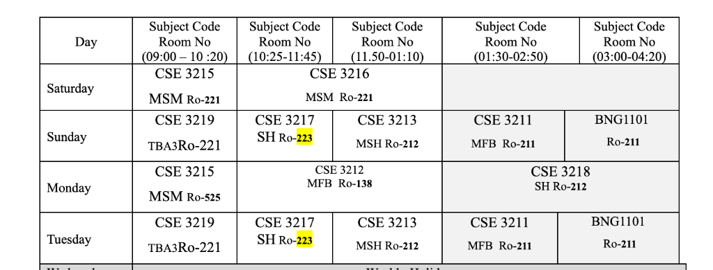
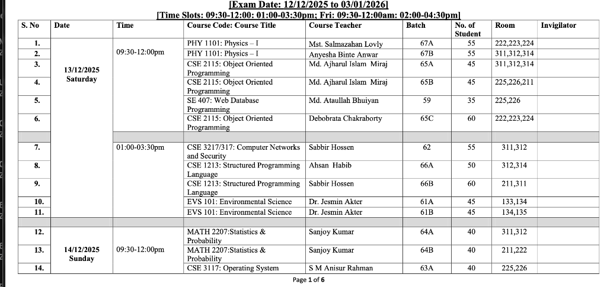

# Admin Dashboard User Guide

This guide explains how to use the UniSync Admin Dashboard to manage instructors, routines, and exam schedules.

## Table of Contents

1. [Understanding Key Concepts](#understanding-key-concepts)
2. [Managing Instructors](#managing-instructors)
3. [Managing Routines](#managing-routines)
4. [Managing Exam Schedules](#managing-exam-schedules)

---

## Understanding Key Concepts

Before using the admin dashboard, it's important to understand the core academic concepts in UniSync:

### Academic Structure

#### Department
An academic department within the institution (e.g., Computer Science & Engineering, Electrical Engineering).

#### Course
A course from the course catalog that defines:
- **Course Code**: Unique identifier (e.g., CSE 3215, PHY 1101)
- **Course Name**: Full name (e.g., "Object Oriented Programming")
- **Credit Hours**: Academic credits (e.g., 3.0)
- **Semester**: Which semester the course is typically offered (e.g., 5th semester)
- **Course Type**: THEORY, LAB, or PROJECT

#### Batch
A group of students who enrolled in the same academic year:
- **Name**: Identifier (e.g., "Batch 65", "2023")
- **Department**: Which department the batch belongs to
- **Current Semester**: Which semester they're currently in
- **Year**: Enrollment year
- **Start/End Date**: Academic period

#### Section
A subdivision of a batch for organizing students into smaller groups:
- **Name**: Section identifier (e.g., "A", "B", "65A", "65B")
- **Batch**: Which batch this section belongs to
- **Capacity**: Maximum number of students

#### Course Offering
**This is the most important concept** - A course offering represents a **specific instance** of a course being taught to a particular section/batch in a specific academic year.

Think of it as: **"Course X is being taught to Section Y of Batch Z in Academic Year 2024-2025 by Teacher T"**

**Example:**
- Course: CSE 3215 (Object Oriented Programming)
- Batch: Batch 65
- Section: Section B
- Teacher: Md. Ajiarul Islam Miraj
- Academic Year: 2024-2025

This creates one **Course Offering** that can be used for:
- Creating routine entries (weekly schedule)
- Scheduling exams
- Tracking attendance
- Managing assignments

**Why Course Offerings Matter:**
- The same course (e.g., CSE 3215) can be offered to multiple sections
- Each section may have different teachers
- Each offering has its own schedule and exams
- Students are enrolled in specific course offerings, not just courses

### Event System

#### Routine
A **recurring weekly schedule entry** that defines regular class sessions:
- **Name**: Descriptive name (e.g., "CSE 3215 Monday Lecture")
- **Course Offering**: Links to a specific course offering
- **Day of Week**: Which day (0=Sunday, 1=Monday, etc.)
- **Start/End Time**: Class timing
- **Event Type**: lecture, lab, tutorial, exam, other
- **Effective Period**: Date range when this routine is active
- **Status**: Active or Inactive

#### Event
A **specific occurrence** of a scheduled activity:
- **Event Type**: exam, lecture, lab, meeting, etc.
- **Title**: Event name
- **Course Offering**: Optional link to course offering
- **Date**: Specific date
- **Start/End Time**: Event timing
- **Status**: scheduled, ongoing, completed, cancelled
- **Priority**: normal, high, urgent
- **Routine**: Optional link if generated from a routine

#### Event Room
Assigns physical rooms/venues to events (supports multiple rooms per event):
- **Event**: Which event this is for
- **Room**: Physical room from venue system
- **Capacity**: Room capacity
- **Is Primary Room**: Main room indicator

#### Event Instructor
Assigns instructors to specific event rooms (supports multiple instructors):
- **Event Room**: Which room assignment
- **Instructor**: Teacher/instructor account
- **Role**: Teaching role (e.g., "Primary Instructor", "Lab Assistant")
- **Is Primary**: Main instructor indicator

### Venue System

#### Building
Physical buildings on campus:
- **Name**: Building name
- **Code**: Short identifier
- **Address**: Location
- **Coordinates**: Latitude/Longitude

#### Room
Individual rooms within buildings:
- **Building**: Which building
- **Room Number**: Room identifier
- **Floor**: Floor level
- **Room Name**: Descriptive name
- **Capacity**: Maximum occupancy
- **Facilities**: JSON data for equipment/features

---

## Managing Instructors

Instructors are users with teaching privileges in the system. Each instructor has an account and an optional profile.

### Adding a New Instructor

1. **Navigate to Instructor Management**
   - Go to Dashboard → Instructor

2. **Click "Add Instructor" Button**

3. **Fill in Account Information:**
   - **Phone**: 11-digit phone number (e.g., 01712345678)
     - This is the primary login identifier
     - Cannot be changed after creation
   - **Email**: Optional email address
   - **Password**: Minimum 6 characters (required for new accounts)
   - **Role**: Select either:
     - **Instructor**: Regular teaching staff
     - **Admin**: Full administrative access
   - **Active**: Toggle to enable/disable the account

4. **Click "Create"**

### Adding Instructor Profile

After creating an instructor account, you should add their profile information:

1. **Find the instructor** in the list
2. **Click "Profile" button**
3. **Fill in Profile Details:**
   - **First Name**: Instructor's first name (e.g., "Md. Ajiarul Islam")
   - **Last Name**: Instructor's last name (e.g., "Miraj")
   - **Employee/Instructor ID**: Optional employee identifier
   - **Date of Birth**: Optional
   - **Address**: Optional full address

4. **Click "Create" or "Update"**

### Editing Instructors

- **Edit Account**: Click "Edit" to modify email, role, or active status
- **Edit Profile**: Click "Profile" to update personal information

### Example: Creating an Instructor

**Scenario:** Add instructor "Md. Ajiarul Islam Miraj" who teaches CSE courses

**Step 1 - Create Account:**
```
Phone: 01712345678
Email: miraj@university.edu
Password: secure123
Role: Instructor
Active: ✓ (checked)
```

**Step 2 - Add Profile:**
```
First Name: Md. Ajiarul Islam
Last Name: Miraj
Employee ID: CSE-001
Date of Birth: 1985-05-15
Address: Dhaka, Bangladesh
```

---

## Managing Routines

Routines define the **weekly recurring schedule** for classes. They automatically generate events for the specified period.

### Prerequisites

Before creating routines, ensure you have:
1. ✓ Created the course in the system (e.g., CSE 3215)
2. ✓ Created the batch (e.g., Batch 65)
3. ✓ Created the section (e.g., Section B)
4. ✓ Created the instructor account
5. ✓ **Created a Course Offering** linking course + batch + section + teacher

### Adding a Routine

1. **Navigate to Routine Management**
   - Go to Dashboard → Routine → Routines tab

2. **Click "Add Routine" Button**

3. **Fill in Routine Details:**

   - **Name**: Descriptive identifier
     - Example: "CSE 3215 Monday Lecture"
     - Example: "CSE 3217 Sunday Lab"
   
   - **Course Offering**: Select from dropdown
     - Shows format: `COURSE_CODE - COURSE_NAME (SECTION / BATCH)`
     - Example: "CSE 3215 - Object Oriented Programming (B / Batch 65)"
   
   - **Day of Week**: Select the day
     - Sunday, Monday, Tuesday, Wednesday, Thursday, Friday, Saturday
   
   - **Start Time**: Class start time (24-hour format)
     - Example: 09:00
   
   - **End Time**: Class end time (24-hour format)
     - Example: 10:20
   
   - **Event Type**: Select type
     - **Lecture**: Regular theory class
     - **Lab**: Laboratory session
     - **Tutorial**: Tutorial/problem-solving session
     - **Exam**: Examination
     - **Other**: Other activities
   
   - **Effective From**: Start date for this routine
     - Example: 2025-01-01
   
   - **Effective To**: End date for this routine
     - Example: 2025-06-30
   
   - **Active**: Toggle to enable/disable
     - ✓ Active routines generate events
     - ✗ Inactive routines are ignored

4. **Click "Create"**

### Example: Creating a Weekly Class Schedule

Based on the routine table image you provided, here's how to create the schedule:



#### Saturday Schedule

**Routine 1:**
```
Name: CSE 3215 Saturday Morning
Course Offering: CSE 3215 - (MSM / Batch 65)
Day of Week: Saturday
Start Time: 09:00
End Time: 10:20
Event Type: Lecture
Effective From: 2025-01-01
Effective To: 2025-06-30
Active: ✓
```

**Routine 2:**
```
Name: CSE 3216 Saturday Late Morning
Course Offering: CSE 3216 - (MSM / Batch 65)
Day of Week: Saturday
Start Time: 10:25
End Time: 11:45
Event Type: Lecture
Effective From: 2025-01-01
Effective To: 2025-06-30
Active: ✓
```

#### Sunday Schedule

**Routine 1:**
```
Name: CSE 3219 Sunday Morning
Course Offering: CSE 3219 - (TBA3 / Batch 65)
Day of Week: Sunday
Start Time: 09:00
End Time: 10:20
Event Type: Lecture
Effective From: 2025-01-01
Effective To: 2025-06-30
Active: ✓
```

**Routine 2:**
```
Name: CSE 3217 Sunday Lab
Course Offering: CSE 3217 - (SH / Batch 65)
Day of Week: Sunday
Start Time: 10:25
End Time: 11:45
Event Type: Lab
Effective From: 2025-01-01
Effective To: 2025-06-30
Active: ✓
```

**Routine 3:**
```
Name: CSE 3213 Sunday Midday
Course Offering: CSE 3213 - (MSH / Batch 65)
Day of Week: Sunday
Start Time: 11:50
End Time: 01:10
Event Type: Lecture
Effective From: 2025-01-01
Effective To: 2025-06-30
Active: ✓
```

**Routine 4:**
```
Name: CSE 3211 Sunday Afternoon
Course Offering: CSE 3211 - (MFB / Batch 65)
Day of Week: Sunday
Start Time: 01:30
End Time: 02:50
Event Type: Lecture
Effective From: 2025-01-01
Effective To: 2025-06-30
Active: ✓
```

**Routine 5:**
```
Name: BNG1101 Sunday Late Afternoon
Course Offering: BNG1101 - (Section / Batch 65)
Day of Week: Sunday
Start Time: 03:00
End Time: 04:20
Event Type: Lecture
Effective From: 2025-01-01
Effective To: 2025-06-30
Active: ✓
```

### Managing Routines

- **Edit**: Click "Edit" to modify routine details
- **Copy**: Click "Copy" to duplicate a routine (useful for similar schedules)
- **Delete**: Click "Delete" to remove a routine
- **Filter**: Use table filters to find specific routines

### Routine Exceptions

For one-time schedule changes (holidays, makeup classes), use the "Routine Exceptions" tab to:
- Cancel specific routine occurrences
- Reschedule classes
- Add special events

---

## Managing Exam Schedules

Exam schedules are created as **Events** with type "exam". They can be linked to course offerings and assigned to rooms with invigilators.

### Prerequisites

Before scheduling exams, ensure you have:
1. ✓ Created course offerings
2. ✓ Created instructor accounts (for invigilators)
3. ✓ Created buildings and rooms in the venue system

### Creating an Exam Event

Currently, exam events are managed through the Events system. Here's the conceptual workflow:

1. **Create Event** with type "exam"
2. **Link to Course Offering**
3. **Set Date and Time**
4. **Assign Rooms** (via Event Room)
5. **Assign Invigilators** (via Event Instructor)

### Example: Creating an Exam Schedule

Based on the exam schedule image you provided:



#### Exam Details from Image

**Exam 1: PHY 1101 - Physics I**
```
Event Details:
- Title: PHY 1101: Physics – I
- Event Type: exam
- Course Offering: PHY 1101 (Batch 67A)
- Date: 2025-12-13 (Saturday)
- Start Time: 09:30
- End Time: 12:00
- Status: scheduled
- Priority: high

Event Room 1:
- Room: Room 222,223,224
- Capacity: 55
- Is Primary Room: ✓

Event Instructor 1:
- Instructor: Mst. Salmazahan Lovly
- Role: Invigilator
- Is Primary: ✓
```

**Exam 2: PHY 1101 - Physics I (Another Batch)**
```
Event Details:
- Title: PHY 1101: Physics – I
- Event Type: exam
- Course Offering: PHY 1101 (Batch 67B)
- Date: 2025-12-13 (Saturday)
- Start Time: 09:30
- End Time: 12:00
- Status: scheduled
- Priority: high

Event Room 1:
- Room: Room 311,312,314
- Capacity: 55
- Is Primary Room: ✓

Event Instructor 1:
- Instructor: Anyesha Binte Anwar
- Role: Invigilator
- Is Primary: ✓
```

**Exam 3: CSE 2115 - Object Oriented Programming**
```
Event Details:
- Title: CSE 2115: Object Oriented Programming
- Event Type: exam
- Course Offering: CSE 2115 (Batch 65A)
- Date: 2025-12-13 (Saturday)
- Start Time: 09:30
- End Time: 12:00
- Status: scheduled
- Priority: high

Event Room 1:
- Room: Room 311,312,314
- Capacity: 45
- Is Primary Room: ✓

Event Instructor 1:
- Instructor: Md. Ajiarul Islam Miraj
- Role: Invigilator
- Is Primary: ✓
```

**Exam 4: CSE 2115 - Object Oriented Programming (Another Section)**
```
Event Details:
- Title: CSE 2115: Object Oriented Programming
- Event Type: exam
- Course Offering: CSE 2115 (Batch 65B)
- Date: 2025-12-13 (Saturday)
- Start Time: 09:30
- End Time: 12:00
- Status: scheduled
- Priority: high

Event Room 1:
- Room: Room 225,226,211
- Capacity: 45
- Is Primary Room: ✓

Event Instructor 1:
- Instructor: Md. Ajiarul Islam Miraj
- Role: Invigilator
- Is Primary: ✓
```

**Exam 5: SE 407 - Web Database Programming**
```
Event Details:
- Title: SE 407: Web Database Programming
- Event Type: exam
- Course Offering: SE 407 (Batch 59)
- Date: 2025-12-13 (Saturday)
- Start Time: 09:30
- End Time: 12:00
- Status: scheduled
- Priority: high

Event Room 1:
- Room: Room 225,226
- Capacity: 35
- Is Primary Room: ✓

Event Instructor 1:
- Instructor: Md. Ataullah Bhuiyan
- Role: Invigilator
- Is Primary: ✓
```

**Afternoon Exam Slot (01:00-03:30pm):**

**Exam 6: CSE 3217/317 - Computer Networks and Security**
```
Event Details:
- Title: CSE 3217/317: Computer Networks and Security
- Event Type: exam
- Course Offering: CSE 3217 (Batch 62)
- Date: 2025-12-13 (Saturday)
- Start Time: 01:00
- End Time: 03:30
- Status: scheduled
- Priority: high

Event Room 1:
- Room: Room 311,312
- Capacity: 55
- Is Primary Room: ✓

Event Instructor 1:
- Instructor: Sabbir Hossen
- Role: Invigilator
- Is Primary: ✓
```

### Exam Scheduling Best Practices

1. **Time Slots**: Use consistent time slots
   - Morning: 09:30-12:00
   - Afternoon: 01:00-03:30
   - Evening: 02:00-04:30

2. **Room Assignment**:
   - Assign rooms based on batch size
   - Consider room capacity
   - Multiple rooms can be assigned to one exam

3. **Invigilator Assignment**:
   - Assign course teacher as primary invigilator when possible
   - Add additional invigilators for large batches
   - Ensure no scheduling conflicts

4. **Batch Organization**:
   - Group exams by batch and course
   - Avoid scheduling conflicts for students
   - Consider room availability

5. **Metadata Usage**:
   - Store additional info in the metadata JSON field
   - Examples: special instructions, materials allowed, exam format

---

## Data Flow Summary

### Creating a Complete Class Schedule

```
1. Create Department (e.g., CSE)
   ↓
2. Create Course (e.g., CSE 3215 - OOP)
   ↓
3. Create Batch (e.g., Batch 65)
   ↓
4. Create Section (e.g., Section B)
   ↓
5. Create Instructor Account + Profile
   ↓
6. Create Course Offering
   (Links: Course + Batch + Section + Teacher + Academic Year)
   ↓
7. Create Routine
   (Uses: Course Offering + Day + Time + Period)
   ↓
8. System automatically generates Events from Routine
```

### Creating an Exam Schedule

```
1. Ensure Course Offering exists
   ↓
2. Create Building and Rooms (if not exists)
   ↓
3. Create Instructor Accounts (for invigilators)
   ↓
4. Create Event (type: exam)
   (Links: Course Offering + Date + Time)
   ↓
5. Create Event Room
   (Links: Event + Room)
   ↓
6. Create Event Instructor
   (Links: Event Room + Instructor)
```

---

## Tips and Troubleshooting

### Common Issues

**Issue: Cannot find Course Offering in dropdown**
- **Solution**: Ensure you've created the Course Offering first
- Check that course, batch, section, and teacher all exist
- Verify the academic year is set

**Issue: Routine not generating events**
- **Solution**: Check that routine is marked as "Active"
- Verify effective dates are correct
- Ensure course offering is valid

**Issue: Cannot assign instructor to exam**
- **Solution**: Ensure instructor account exists with role "instructor" or "admin"
- Check that instructor profile is created
- Verify no scheduling conflicts

### Best Practices

1. **Naming Conventions**:
   - Routines: `COURSE_CODE Day Type` (e.g., "CSE 3215 Monday Lecture")
   - Events: `COURSE_CODE: Full Name` (e.g., "CSE 2115: Object Oriented Programming")

2. **Data Entry Order**:
   - Always create in hierarchical order: Department → Course → Batch → Section → Course Offering
   - Create instructors before assigning them to courses
   - Create venues before scheduling exams

3. **Verification**:
   - After creating routines, check the Events tab to verify generation
   - Review exam schedules for conflicts
   - Verify room capacities match batch sizes

4. **Maintenance**:
   - Regularly update instructor profiles
   - Archive old course offerings
   - Clean up inactive routines

---

## Additional Resources

- [Installation Guide](./installation.md)
- [Managing Events](./managing-events.md)
- [API Reference](../api/)
- [Architecture Documentation](../architecture/)

## Support

For technical issues or questions:
- Email: foysal.developer@gmail.com
- Check the project README for more information
